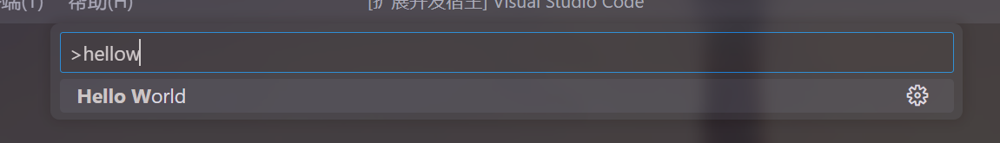
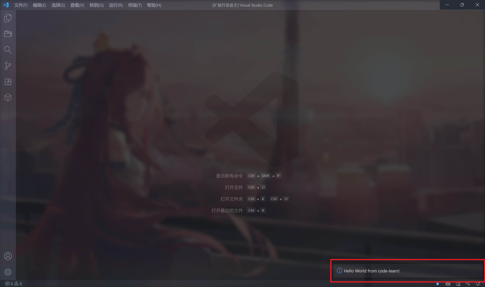

# VSCode Study

> 在这里进行 VSCode 的学习.

## 如何创建项目

这里需要安装一个工具, 我们通过这个工具来创建项目:

```shell
npm install -g yo generator-code
```

随后, 直接使用命令即可创建项目:

```shell
yo code
```

## 运行方法

直接在 VSCode 中打开, 按下 "F5" 即可运行该插件了.

对于初始项目来说, 可以在控制面板中输入 `helloworld` 来调用插件, 输出一个提示语.



回车后, 就可以看到效果了:



